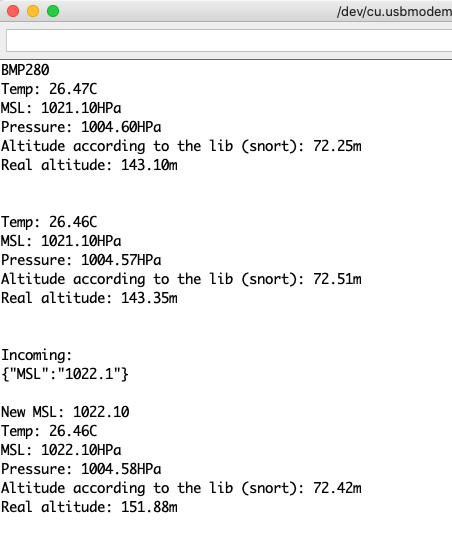

# BastWAN_BMP280

BMP280 demo using SeeedStudio's module and code, with improvements – using a BastWAN because I can.

The library's `calcAltitude()` function uses a fixed value for the MSL – stooooopid! – and a weird formula that, even when using a proper MSL, produces a not very accurate altitude. Using [this formula](https://keisan.casio.com/exec/system/1224585971), I got a much more accurate altitude.

Original formula:
```c
float BMP280::calcAltitude(float p0) {
  float A = p0 / 101325;
  float B = 1 / 5.25588;
  float C = pow(A, B);
  C = 1.0 - C;
  C = C / 0.0000225577;
  return C;
}
```

New formula:
```c
float B = 1 / 5.25588;
float calcAltitude(float p0, float p1, float t) {
  float C = pow((p0 / p1), B) - 1.0;
  return (C * (t + 273.15)) / 0.0065;
}
```

You can send a JSON message in the Serial Monitor to change the MSL:

```JSON
{"MSL":"1022.1"}
```
